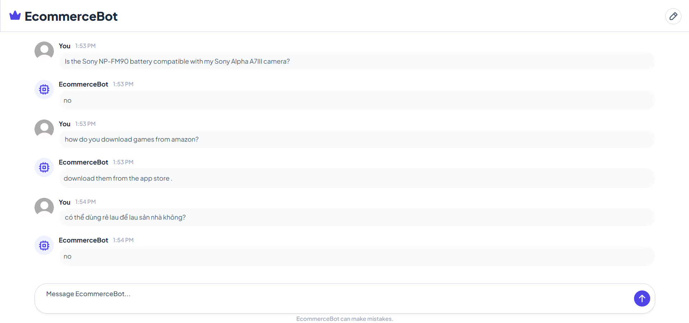

## Introduction
This project implements an E-commerce chatbot (EcommerceBot) designed to support customers and enhance their shopping experience.

## Dataset
The chatbot utilizes the Amazon question/answer dataset provied by Julian McAuley:
https://cseweb.ucsd.edu/~jmcauley/datasets/amazon/qa/

## Features

- **Frontend**: Build with HTML
- **Backend**: Developed with Python, implementing a Retrieval-Augmented Generation (RAG) architecture.

    - **Retriever**: Employed the pretrained model  sentence-transformers/all-MiniLM-L6-v2 to tokenize and embed data, then find the related documents (context).

    - **Generator**: Used google/flan-t5-base, taking the question and context as input to generate accurate answers.

## Project Structure

```
Ecommerce-QA/
├── assets/             # Images
├── data/               # Dataset files
├── model/              # RAG
├── pages/              # Include index.html 
└── app.py              # Main script
```

## User Guide

1. Clone repository to your local
2. Install the required libraries:
```bash
pip install -r requirements.txt
```
3. Run the application
```bash
app.py
```
4. Run server and access the chatbot interface: http://127.0.0.1:5500/pages/ChatInterface.html

## Test


## Note
The project utilizes a reduced dataset `reduce_data.json`, which is 90% smaller than original dataset `data.json`. As a result, the RAG model may occasionally generate answers that are not present in dataset.